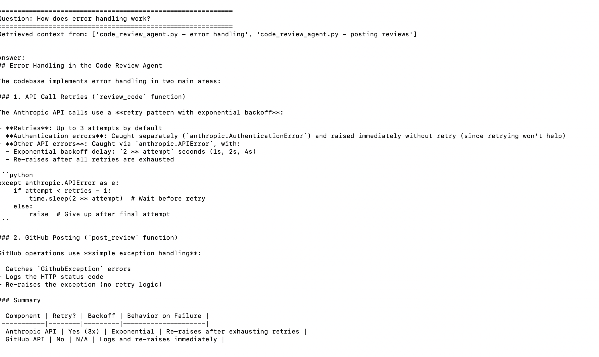
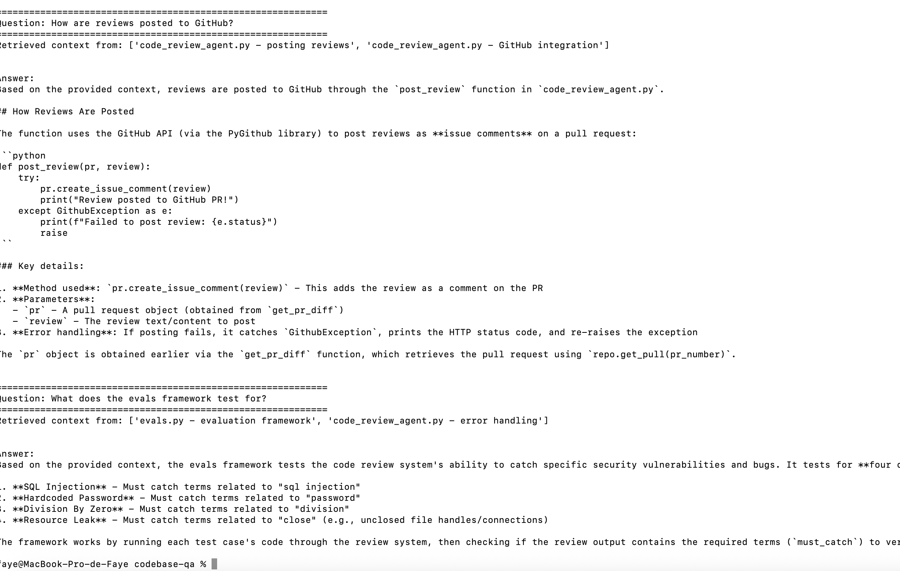

# Codebase Q&A Bot (RAG)

A Retrieval Augmented Generation (RAG) app that answers natural language questions about a codebase using embeddings, vector search, and Claude AI.

## How It Works

Instead of sending an entire codebase to an LLM (too large, hits token limits), this app:

1. **Indexes** code chunks by converting them to embeddings (vectors that represent meaning)
2. **Retrieves** the most relevant chunks when a question is asked
3. **Generates** an accurate answer using only the relevant context

## Demo

### How the agent retrieves relevant context and answers questions

**Question: How does error handling work?**


**Question: How are reviews posted to GitHub? / What does the evals framework test for?**


## Architecture
Question comes in
↓
Convert question to embedding
↓
Search ChromaDB for similar chunks
↓
Send relevant chunks + question to Claude
↓
Get accurate, context-aware answer
## Example Questions

- "How does error handling work?"
- "How are reviews posted to GitHub?"
- "What does the evals framework test for?"

## Setup

1. Clone the repo
2. Install dependencies:

```bash
pip3 install anthropic chromadb sentence-transformers python-dotenv
```

3. Create a `.env` file:
ANTHROPIC_API_KEY=your-anthropic-key
4. Run it:

```bash
python3 rag.py
```

## Tech Stack

- Python
- Anthropic Claude API (claude-opus-4-5)
- ChromaDB (vector store)
- Sentence Transformers (embeddings)